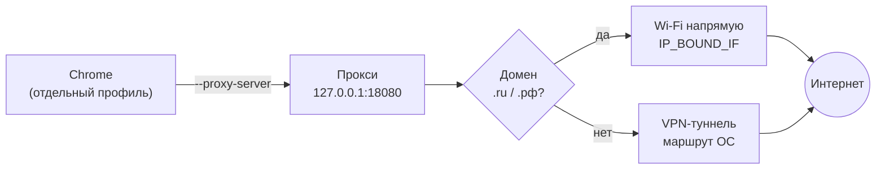

# VPN Bypass Proxy

Локальный split-tunnel прокси для macOS: домены `.ru` и `.рф` ходят напрямую через Wi-Fi **мимо VPN**, весь остальной трафик остаётся **внутри VPN**.




## Зачем это нужно

Под VPN весь трафик идёт через туннель — включая российские сайты, которые часто блокируют иностранные IP или просто тормозят. Прокси смотрит на домен каждого соединения и решает: увести мимо VPN или оставить в туннеле.

## Как работает

Прокси слушает `127.0.0.1:18080`, Chrome запускается с отдельным профилем и флагом `--proxy-server` на него. Дальше по домену:

- заканчивается на `.ru` или `.xn--p1ai` (punycode для `.рф`) → сокет привязывается к Wi-Fi опцией ядра `IP_BOUND_IF` (`25` для IPv4, `125` для IPv6). Она уводит соединение в указанный интерфейс в обход таблицы маршрутизации, а значит и в обход VPN;
- иначе → обычная маршрутизация ОС, то есть через VPN.

HTTPS проходит непрозрачным CONNECT-туннелем — TLS не расшифровывается. Подключение идёт по Happy Eyeballs: IPv4 и IPv6 пробуются параллельно, побеждает первый ответивший.

## Запуск

Скрипты работают из своей папки — проект можно держать где угодно.

```bash
cd go                    # или cpp / python
./start-proxy.command    # запустить прокси и открыть Chrome через него
./stop-proxy.command     # остановить
./clean-data.command     # закрыть Chrome, снести профиль и логи
```

Двойной клик из Finder тоже работает. В папке появятся `proxy.log`, `proxy.pid`, `chrome-profile/` и бинарник `proxy` — всё в `.gitignore`.

## Как убедиться, что работает

Самый быстрый способ — смотреть, какое решение принимает прокси:

```bash
tail -f proxy.log
```

Походите по сайтам в открывшемся Chrome — в логе появятся строки вида:

```
[https host] ya.ru
[route] BYPASS_VPN_VIA_WIFI
[https host] github.com
[route] DEFAULT_VPN
```

Самопроверка: откройте в этом Chrome российский сервис определения IP и любой зарубежный. Адреса должны **отличаться** — первый покажет ваш домашний IP, второй IP вашего VPN.

## Реализации

Одна и та же логика написана на трёх языках: удобно сравнивать как язык меняет решение — ручной `select` в C++ против горутин в Go. Внешних зависимостей нет нигде, любую версию можно запускать как основную.

| Папка | Требования | Особенности |
|-------|------------|-------------|
| `python/` | Python 3.10+ | эталон, компилировать нечего |
| `cpp/` | clang++ / C++20 | Happy Eyeballs вручную через `select`; пересборка только если исходник новее бинарника |
| `go/` | Go 1.20+ | Happy Eyeballs берёт на себя `net.Dialer`, горутина на соединение, `go.mod` не нужен |

## Настройка

| Что | Где | По умолчанию |
|-----|-----|--------------|
| Wi-Fi-интерфейс | `BYPASS_IFACE` | автоопределение через `networksetup` |
| Порт | `LISTEN_PORT` / `listenAddr` в исходнике | `18080` |
| Обходные домены | `should_bypass_vpn` | `.ru`, `.рф` |

## Если не работает

| Симптом | Причина и что делать |
|---------|----------------------|
| `Proxy is already running` | порт занят прошлым запуском: `./stop-proxy.command`, при необходимости проверить `lsof -nP -iTCP:18080 -sTCP:LISTEN` |
| Chrome открылся, но сайты не грузятся | прокси не поднялся — смотреть `proxy.log` |
| `.ru`-сайт не обходит VPN | в логе `[route] DEFAULT_VPN` — домен не попал под правило (частый случай: российский сервис на домене `.com`) |
| Обход не срабатывает вообще | выбран не тот интерфейс. Посмотреть `networksetup -listallhardwareports` и задать явно: `export BYPASS_IFACE=en0` |
| `Build failed` в `cpp/` | нужен компилятор с C++20: `clang++ --version` |

## Ограничения

- **Только macOS** — `IP_BOUND_IF` платформенный.
- **Работает только в том Chrome, что запущен скриптом.** Системный перехват потребовал бы Network Extension.
- **DNS идёт через VPN** — привязывается только TCP-соединение, имя резолвит системный резолвер.
- **HTTP без keep-alive** — каждый запрос закрывает соединение (на HTTPS не влияет).
- **Не проксирует UDP/WebRTC.**
- **Без аутентификации** — слушает `127.0.0.1`, но доступен любому локальному процессу.
- **Отдельный профиль Chrome** — свои закладки и логины.
